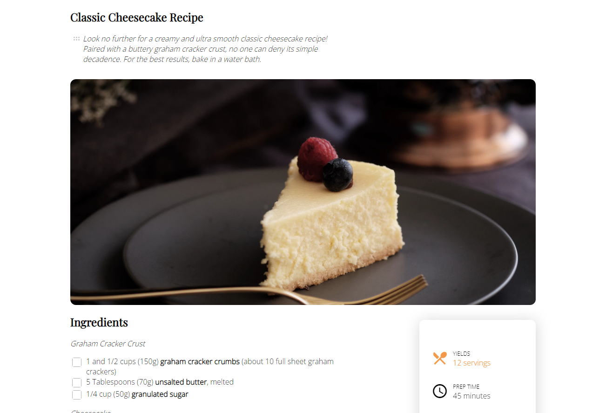

<!-- Please update value in the {}  -->

<h1 align="center">Cheesecake Recipe</h1>

   Solution for a challenge from  <a href="http://devchallenges.io" target="_blank">Devchallenges.io</a>.

  <h3>
    <a href="https://cloudberries27.github.io/DevChallenge-RecipeBlog/">
      Demo
    </a>
     | 
    <a href="https://github.com/cloudberries27/DevChallenge-RecipeBlog">
      Solution
    </a>
     | 
    <a href="https://devchallenges.io/challenges/OEKdUZ6xs0h99C38XVht">
      Challenge
    </a>
  </h3>

<!-- TABLE OF CONTENTS -->

## Table of Contents

- [Overview](#overview)
  - [Built With](#built-with)
- [Features](#features)
- [Acknowledgements](#acknowledgements)
- [Contact](#contact)

<!-- OVERVIEW -->

## Overview

- Demo is above ^^^
- I think I struggled most with those checkboxes and numbers. At first I really wanted to use the numbers on the ordered list but I just wasn't able to style them properly, so I said screw it and turned them into spans. Spans were made for backgrounds and padding lol. Then those checkboxes, as I searched the web for some way to add a color to the background, the majority of solutions suggested getting rid of the checkbox and adding my own version of one. It really should be easier than that like I can't believe its 2022 and we can't style a checkbox! 😤 Anyway, thank goodness for StackOverflow, some genius on there thought to use filters on checkboxes and saved me the trouble of making my own!  
- I learned filters are awesome, spans are handy and that html6/css5 need to make numbers and checkboxes style-able (I don't think that's a word, but let's pretend it is). 
- Inspirational Quote of the Day: "Try not to break the Multiverse, Stephen" - Wanda Maximoff (EEP - I love her, she was amazing in Dr.Strange 2)
- Guys, I'm just now realizing the checkboxes did not need a color...you know what, it's okay I learned something out of it anyway!

### Built With

<!-- This section should list any major frameworks that you built your project using. Here are a few examples.-->

- HTML
- CSS

## Features

<!-- List the features of your application or follow the template. Don't share the figma file here :) -->

This application/site was created as a submission to a [DevChallenges](https://devchallenges.io/challenges) challenge. The [challenge](https://devchallenges.io/challenges/TtUjDt19eIHxNQ4n5jps) was to build an application to complete the following user stories:

- [x] User story: I can see a recipe with ingredients and instructions
- [x] User story: I can select a checkbox if I have the ingredients
- [x] User story: I can see the number of servings, baking times

## Acknowledgements

<!-- This section should list any articles or add-ons/plugins that helps you to complete the project. This is optional but it will help you in the future. For example -->

- [Checkbox Background Color](https://stackoverflow.com/questions/24322599/why-cannot-change-checkbox-color-whatever-i-do)
- [Material Icons](https://fonts.google.com/icons)

## Contact

- Website [fanamera.com](https://fanamera.com)
- GitHub [@cloudberries27](https://github.com/cloudberries27)
- Codepen [@cloudberries27](https://codepen.io/cloudberries27)
